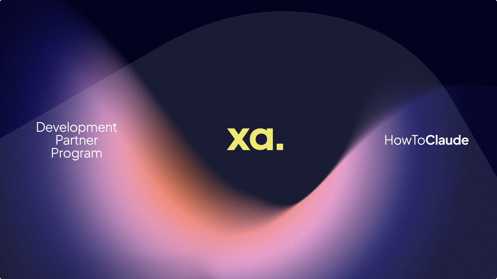

<h1 align="center">How to Build with Claude</h1>

  <strong>Domain experts building the solutions they need, supported by senior engineers.</strong>

  
  
  
  

  A new development paradigm where domain experts build solutions from inside the problem space, with AI-assisted tooling and support from senior engineers.

---

# How to Build with Claude

## Our Development Thesis

The people closest to the problem are best positioned to solve it. They live with the friction of today's tools day-to-day and understand exactly where process velocity breaks down. Rather than wait for engineers disconnected from the context, we believe domain experts should build the solutions they need.

This is the **Domain Expert Partner (DEP)** model — similar in spirit to the Forward Deployed Engineer approach, but inverted. Here, the builder is a domain expert first who gains access to AI-assisted development tools that let them design and implement solutions from inside the problem space. They are supported by senior engineers who take these solutions and make them safe, efficient, and scalable — turning rapid domain-driven iteration into production-grade systems.

---

## Development Partner Program

We support domain experts at four levels, each with increasing autonomy and responsibility.

### Tier 1 — Plan Mode

Domain experts gain code access and work with Claude to develop detailed plans for features that solve specific problems they see in the platform. Plans are submitted as `FEATURE_PLAN.md` files in the `/partner-docs` folder for review and feedback. This phase is about validating the approach before implementation begins.

### Tier 2 — Feature Branch Mode

Domain experts work within a dedicated feature branch to both plan and implement features. They have full freedom to develop solutions and can submit pull requests to the dev branch. Senior engineers review, test, and approve these PRs before they move forward.

### Tier 3 — Dev Mode

Domain experts can work directly in the dev branch and have access to Vercel logs to review the live dev environment. They are able to publish features into the dev environment for immediate review and testing. All features submitted at this tier must include test coverage.

### Tier 4 — Production Mode

Domain experts can work across all branches and have the ability to release features directly to production. This tier is reserved for partners who have demonstrated they can consistently ship working, valuable, and scalable features.

---

## Get Set Up

This is the plain-English checklist of the accounts to create and the tools to install before you sit down with Claude in a terminal window — whatever you're building. No coding experience assumed.

> [!NOTE]
> **The big picture.** You'll talk to Claude in a terminal; it writes and runs the code for you. Five accounts give that work somewhere to live: GitHub stores the project, Anthropic & OpenAI are the AI brains, Vercel puts the app on the web, and Cloudflare handles your domain. Create them in this order — later steps reuse the earlier logins.

---

## Pick your setup guide

- **[macOS Setup](MACOS.md)** — Homebrew, Node, Claude Code
- **[Windows / PC Setup](PC.md)** — Scoop, Node, Claude Code
